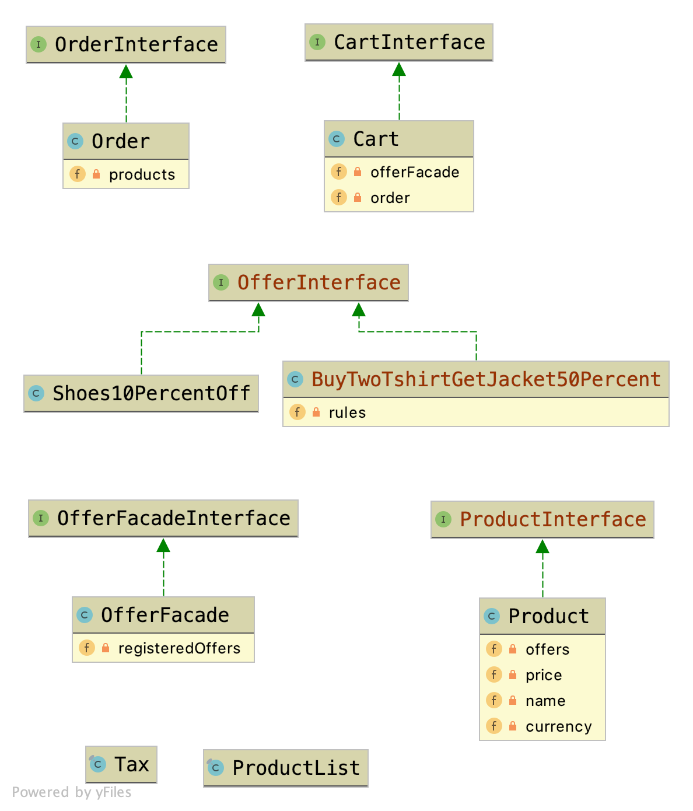

### Class diagram



## Requirements
- [Requirements](requirement.md)
- Available catalog products and their price in USD:
    * T-shirt $10.99
    * Pants $14.99
    * Jacket $19.99
    * Shoes $24.99

## Installation
- Run `make build`

### To Create cart
- First run `make bash`
    - then try `bin/createCart.php --bill-currency=EGP T-shirt T-shirt shoes jacket`
        - Response
        ```json
        {
            "SubTotal": "1052 EGP",
            "Taxes": "147.28 EGP",
            "Discounts": [
                "50% off Jacket: -156.921 EGP",
                "10% off Shoes: -39.234 EGP"
            ],
            "Total": "975.84 EGP"
        }
    - or try `bin/createCart.php --bill-currency=USD T-shirt T-shirt shoes jacket`
        - Response
        ```json
          {
              "SubTotal": "67 USD",
              "Taxes": "9.38 USD",
              "Discounts": [
                  "50% off Jacket: -9.995 USD",
                  "10% off Shoes: -2.499 USD"
              ],
              "Total": "62.7 USD"
          }
    - or try `bin/createCart.php T-shirt T-shirt shoes`
        - Response
        ```json
      {
          "SubTotal": "47 USD",
          "Taxes": "6.58 USD",
          "Discounts": [
              "10% off Shoes: -2.499 USD"
          ],
          "Total": "51.3 USD"
      }

### Built With

* [PHP7.4](http://php.net)
* [Composer](https://getcomposer.org/)
* [PHPUnit](https://phpunit.de/)
